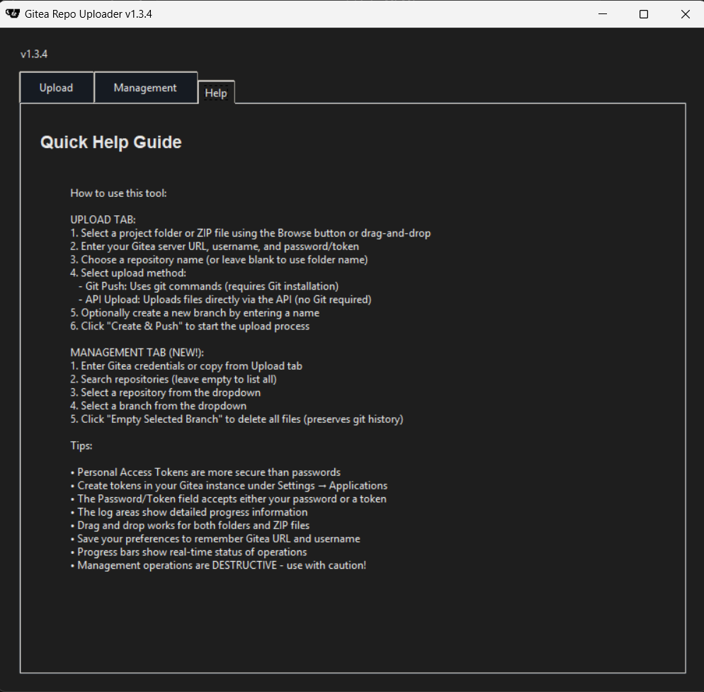

# GiteaMGMT - Gitea Repository Management Application

A cross-platform Python GUI application that simplifies pushing local directories to Gitea repositories. This tool automates the process of creating repositories, initializing git repositories locally if needed, and pushing content without storing credentials.

## Overview

The Gitea Manager provides a user-friendly interface for managing the upload of local projects to Gitea repositories without having to manually perform multiple git operations or use the web interface for repository creation.

**Key benefits:**
- Save time by automating repository creation and initial push
- Improve security by avoiding credential storage
- Simplify workflow with intuitive GUI
- Accommodate different preferences with multiple upload methods
- Monitor progress with real-time indicators

## Table of Contents

- [Features](#features)
- [Requirements](#requirements)
- [Installation](#installation)
- [Usage](#usage)
  - [Basic Workflow](#basic-workflow)
  - [Operation Modes](#operation-modes)
  - [Branch Management](#branch-management)
  - [Repository Management](#repository-management)
  - [Security Notes](#security-notes)
- [New in Version 1.3.0](#new-in-version-130)
- [Documentation](#documentation)
- [API Tokens](#api-tokens)
- [Best Practices](#best-practices)
- [FAQ](#faq)
- [Contributing](#contributing)
- [License](#license)
- [Screenshots](#screenshots)

## Features

- **Cross-platform** GUI (Linux, Windows, macOS) with a professional gray theme
- **Multiple upload methods**:
  - Standard Git push with automatic repository initialization
  - API-based file upload (no Git required)
- **Flexible input**:
  - Browse to select folders
  - Direct drag-and-drop onto the application window
  - Command-line path argument support
- **Progress tracking**:
  - Real-time progress indicators for uploads
  - Detailed status messages
  - Comprehensive logging system
- **Credential security**:
  - Uses one-shot authentication URLs for Git operations
  - No credentials stored in git config
- **Simple authentication**:
  - Unified password/token field (accepts Personal Access Tokens or passwords)
  - No credential storage for security
- **Repository management**:
  - Create new repositories via API
  - Create and push to new branches
  - Automatic repository creation under your user account
  - Search and manage existing repositories
  - Empty branches by deleting all files (Management tab)
- **File handling**:
  - Optionally extract ZIP files before pushing
  - Handles large directories with progress feedback
- **User convenience**:
  - Modern tabbed interface with clear organization
  - Remember previously used settings
  - Tooltip help system

## Requirements

- Git CLI installed and on PATH (required for Git push mode)
- Python 3.8+ with tkinter support
- Internet connection to your Gitea server

### Important Note for Windows Users

If you encounter an error about "Can't find a usable init.tcl" or "Tcl wasn't installed properly", this means your Python installation is missing tkinter support. To fix this:

1. **Reinstall Python** from [python.org](https://www.python.org/downloads/) and make sure to check "tcl/tk and IDLE" during installation
2. **Or use a different Python distribution** like Anaconda which includes tkinter by default
3. **Or install tkinter separately** (on some Linux distributions): `sudo apt-get install python3-tk`

The application will work perfectly once tkinter is properly installed.

## Installation

No installation required! Just download the files and run the appropriate wrapper script for your platform:

### Windows

1. Download `app.py` and `run.bat`
2. Double-click `run.bat` to launch the application
3. You can also drag a folder onto `run.bat` to pre-fill the path
4. The script will automatically:
   - Create a virtual environment with compatible Python version
   - Install dependencies from requirements.txt
   - Test for tkinter support and fix Python version conflicts
   - Recreate virtual environment if tkinter issues are detected
   - Launch the GUI in headless mode (no terminal window remains open)
   - Provide helpful error messages and automatic fixes

### Linux/macOS

1. Download `app.py` and `run.sh`
2. Make the script executable: `chmod +x run.sh`
3. Run with `./run.sh`
4. Or pass a path directly: `./run.sh /path/to/your/project`
5. The script will automatically:
   - Create a virtual environment with compatible Python version
   - Install dependencies from requirements.txt
   - Test for tkinter support and fix any issues automatically
   - Launch the GUI in background mode (terminal closes automatically)
   - Provide helpful error messages and automatic fixes

## Usage

### Basic Workflow

1. Select a folder (or ZIP file) containing your project by:
   - Using the Browse button
   - Dragging and dropping directly onto the application window
   - Passing the path as a command-line argument
2. Enter your Gitea server URL, username, and password/token
3. Choose a repository name (defaults to folder name if left blank)
4. Select your preferred operation mode
5. Configure additional options if needed
6. Click "Create & Push" to start the process and monitor progress

### Operation Modes

#### Git Push (Standard)

The default mode that uses Git commands to:
- Initialize a local repository if one doesn't exist
- Create a remote repository via the Gitea API
- Commit all files if needed
- Push to the remote repository without storing credentials
- If the remote already has commits and the push is rejected, the app
  automatically fetches the remote branch, merges histories with a
  merge commit preferring your local changes, and pushes again. This
  preserves remote history and avoids manual pull/merge steps.

This mode requires Git to be installed and available on your PATH.

#### API Upload (File Upload)

An alternative mode that:
- Creates a remote repository via the Gitea API
- Uploads files directly via the Gitea API without using Git
- Overwrites existing files
- Shows individual file upload progress

This mode doesn't require Git and is useful for simple file uploads.
On Windows and other platforms, paths are normalized to POSIX form and
URL-encoded to ensure reliable uploads via the Gitea contents API.

### Branch Management

You can create a new branch by entering a name in the "Create New Branch" field. If left empty, the default branch (main/master) will be used.

The branch workflow supports:
- Creating a new branch from the current state
- Pushing to the new branch
- Setting appropriate upstream tracking

### Repository Management

**New in Version 1.3.0**: The Management tab provides tools for managing existing repositories.

#### Emptying Branches

The Management tab allows you to empty branches by deleting all files while preserving git history:

1. **Setup**: Enter credentials in the Upload tab (Gitea URL, Username, Password/Token)
2. **Search**: Use the search field to find repositories or leave empty to list all
3. **Select Repository**: Choose a repository from the search results
4. **Select Branch**: Choose the branch you want to empty from the branches list
5. **Confirm**: Click "Empty Selected Branch" and confirm by typing the repository name
6. **Monitor**: Watch the progress bar and log for operation status

**Important Notes:**
- This operation is **destructive and irreversible**
- All files will be deleted from the selected branch
- Git history is preserved (this creates a commit that deletes files)
- Requires Git to be installed and on your PATH
- May require special permissions for protected branches

**Use Cases:**
- Clearing out test repositories
- Resetting development branches
- Preparing branches for new content
- Cleaning up after experimental work

### Security Notes

- Personal Access Tokens are recommended over passwords
- The Password/Token field accepts either your password or a Personal Access Token
- No credentials are stored in Git configuration
- For the Git push operation, credentials are only used for a single command with a one-time URL
- SSL/TLS verification can be disabled for self-signed certificates, but this is not recommended
- Only Gitea URL and username can be saved as preferences (never credentials)

## New in Version 1.3.0

Version 1.3.0 introduces powerful repository management capabilities:

- **New Management Tab**: Dedicated interface for managing existing Gitea repositories
- **Repository Search**: Search and browse repositories you have access to
- **Branch Management**: View and select branches within repositories
- **Branch Emptying**: Safely delete all files from a branch while preserving git history
- **Enhanced Security**: Repository management operations use the same secure authentication as uploads
- **Progress Monitoring**: Real-time progress tracking for management operations
- **Confirmation Safeguards**: Multiple confirmation steps prevent accidental destructive operations
- **Comprehensive Logging**: Dedicated log area for management operations with detailed feedback
- **API Integration**: Uses Gitea REST API for efficient repository and branch discovery

**Key Features:**
- Search repositories by name or list all accessible repositories
- Select specific branches within chosen repositories  
- Empty branches with a single operation (deletes all files, commits change, pushes to remote)
- Type-to-confirm safety mechanism requires typing repository name to proceed
- Background operations keep UI responsive during long-running tasks
- Detailed error handling with troubleshooting guidance

**Use Cases:**
- Clean up test repositories and development branches
- Prepare branches for new content without losing git history
- Reset experimental branches while maintaining proper version control
- Manage repository cleanup as part of development workflows

For a complete list of changes, see the [Changelog](logs/changelog.md).

## Documentation

This project includes comprehensive documentation to help you get the most out of the Gitea Repo Uploader:

- [README.md](README.md) - This file, with overview and basic usage
- [Troubleshooting Guide](debug/troubleshooting.md) - Solutions for common issues
- [Changelog](logs/changelog.md) - Version history and planned features

## API Tokens

To create a Personal Access Token for Gitea:

1. Log in to your Gitea instance
2. Go to Settings → Applications
3. Under "Generate New Token," enter a name and select the appropriate scopes:
   - **For Upload features**: `write:repository` (minimum)
   - **For Management features**: `read:repository` and `write:repository` 
   - **For protected branches**: May also need `delete:repository`
4. Click "Generate Token" and copy the generated token
5. Use this token in the application instead of your password

API tokens offer several advantages over passwords:
- Can be scoped to specific permissions
- Easily revoked without changing your password
- More secure for automation purposes

## Best Practices

For the most effective use of this tool:

1. **Organize before uploading**: Make sure your project is properly organized before uploading
2. **Use descriptive repository names**: Choose clear, meaningful names that reflect the project's purpose
3. **Consider .gitignore**: Add appropriate .gitignore files to exclude unnecessary files
4. **Use tokens**: Always prefer Personal Access Tokens over passwords
5. **Regular backups**: Maintain local backups of important repositories
6. **Verify after uploading**: Check the repository in your Gitea instance after uploading
7. **Save preferences**: Use the "Save Preferences" button to remember your Gitea URL and username
8. **Check the logs**: Review the logs directory for detailed operation history if issues occur

## FAQ

**Q: Can I use this tool with GitHub, GitLab, or other git servers?**
A: This tool is specifically designed for Gitea. While the git push functionality might work with other services, the API features are Gitea-specific.

**Q: What happens if a repository already exists?**
A: If a repository with the same name already exists, the tool will attempt to push to it rather than creating a new one.

**Q: Is there a limit to the size of repositories I can upload?**
A: The tool itself doesn't impose limits, but your Gitea instance may have configured maximum file size and repository size limits.

**Q: Can I use SSH keys instead of username/password?**
A: Not currently. The application uses HTTPS authentication with tokens or passwords.

**Q: Where are my preferences stored?**
A: Preferences are stored in a config.ini file in the same directory as the application. Only non-sensitive data like Gitea URL and username are saved.

**Q: How can I see detailed logs?**
A: Log files are stored in the logs directory with timestamps. These contain detailed information about operations and any errors.

**Q: What does the Management tab do?**
A: The Management tab (new in v1.3.0) allows you to search your repositories and empty branches by deleting all files while preserving git history. It's useful for cleaning up test repositories or resetting development branches.

**Q: Is emptying a branch reversible?**
A: No, the branch emptying operation is destructive and cannot be automatically undone. While git history is preserved, the deleted files cannot be recovered through the application. Always ensure you have backups before using this feature.

**Q: Why does the Management tab require Git to be installed?**
A: The branch emptying operation uses Git commands to safely clone, modify, and push changes to repositories. This ensures proper git history handling and compatibility with standard Git workflows.

**Q: Can I empty protected branches?**
A: Protected branches may require additional permissions or temporary removal of protection rules. Check your repository's branch protection settings in Gitea if the operation fails.

For more FAQ and troubleshooting information, see the [Troubleshooting Guide](debug/troubleshooting.md).

## Contributing

Contributions are welcome! If you'd like to improve this tool:

1. Fork the repository
2. Create your feature branch (`git checkout -b feature/amazing-feature`)
3. Commit your changes (`git commit -m 'Add some amazing feature'`)
4. Push to the branch (`git push origin feature/amazing-feature`)
5. Open a Pull Request

Please ensure your code follows the existing style and includes appropriate documentation.

## License

This project is licensed under the MIT License - see the LICENSE file for details.

## Screenshots

### GiteaMGMT Upload GUI

### GiteaMGMT Management GUI

### GiteaMGMT Help GUI

